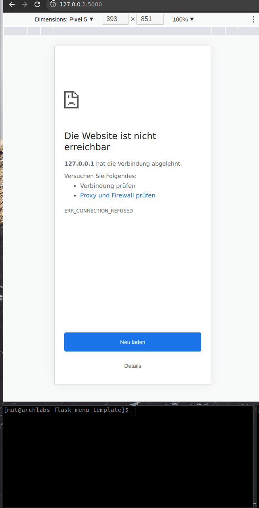

# Flask example

example responsive html mini menue, with flask backend



## Install with pip:

```
$ pip install Flask
```

## start the application

```
$ flask run
```

# How to Add a new function?

0. open file public/index.html
1. copy a existing function
2. change the "value" to the another end point
3. change the "text" of the new function
4. open file app.py
5. add the new function, with the same name as the end point ("value")
6. done
